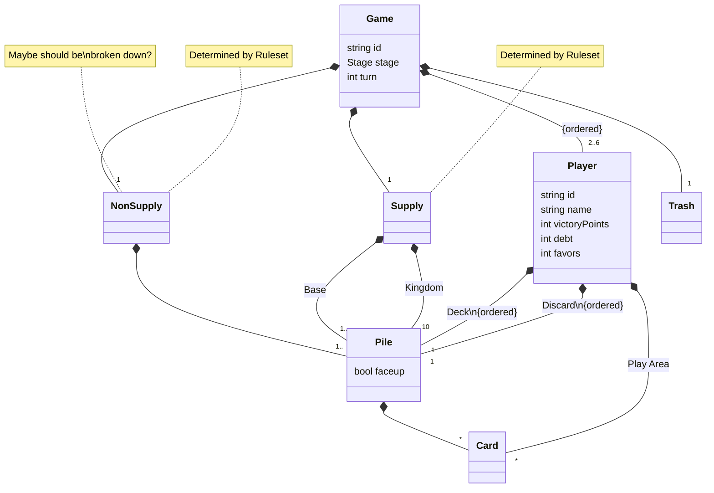

```mermaid
---
Basic Game
---

classDiagram

class Game {
    string id
    Stage stage
    int turn
}

class Player {
    string id
    string name
    int victoryPoints
    int debt
    int favors
}

class Pile {
    bool faceup
}

note for Supply "Determined by Ruleset"
note for NonSupply "Determined by Ruleset"
note for NonSupply "Maybe should be\nbroken down?"

Game *-- "2..6" Player : {ordered}
Game *-- "1" Supply
Game *-- "1" NonSupply
Game *-- "1" Trash
Player *-- "1" Pile : Discard\n{ordered}
Player *-- "1" Pile : Deck\n{ordered}
Player *-- "*" Card : Play Area
%% Ruleset *-- "1" Supply
Supply *-- "10" Pile : Kingdom
Supply *-- "1.." Pile : Base
NonSupply *-- "1.." Pile
%% Ruleset *-- "1" Trash
Pile *-- "*" Card
```
